# PAN-OS MCP Server Architecture

## Overview

The PAN-OS MCP Server is a Model Context Protocol (MCP) implementation that provides a standardized interface for interacting with Palo Alto Networks (PAN-OS) firewalls. It leverages the `modelcontextprotocol` Python SDK to expose firewall functionality through a set of well-defined tools.

## System Architecture

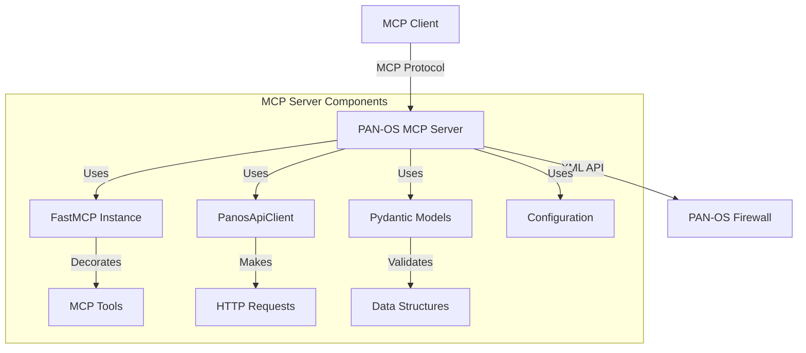

## Core Components

### 1. Server Implementation (`server.py`)

The server module is the main entry point and implements the MCP interface using FastMCP. It provides the following tools:

- `check_health`: Verifies connectivity and retrieves basic system information
- `show_system_info`: Retrieves detailed system information
- `retrieve_address_objects`: Gets configured address objects
- `retrieve_security_zones`: Gets configured security zones

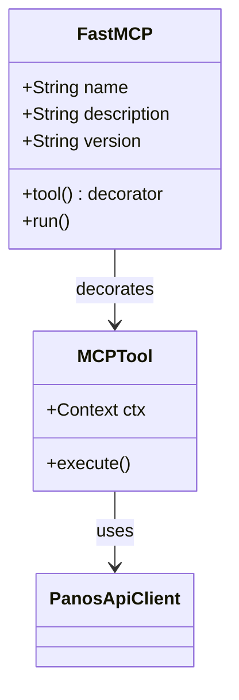

### 2. API Client (`pan_os_api.py`)

The `PanosApiClient` class handles all direct interactions with the PAN-OS XML API:

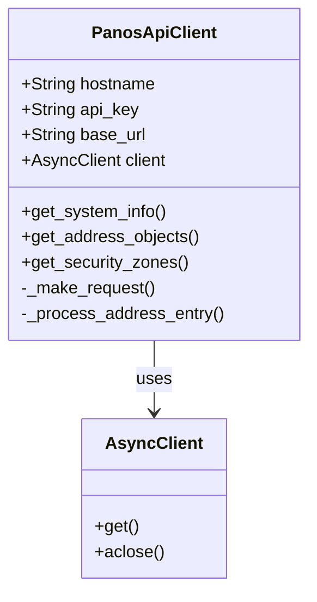

Key features:
- Asynchronous HTTP client implementation
- XML API request handling
- Response parsing and validation
- Error handling and logging
- Context manager support

### 3. Data Models (`models.py`)

The project uses Pydantic models for data validation and serialization:

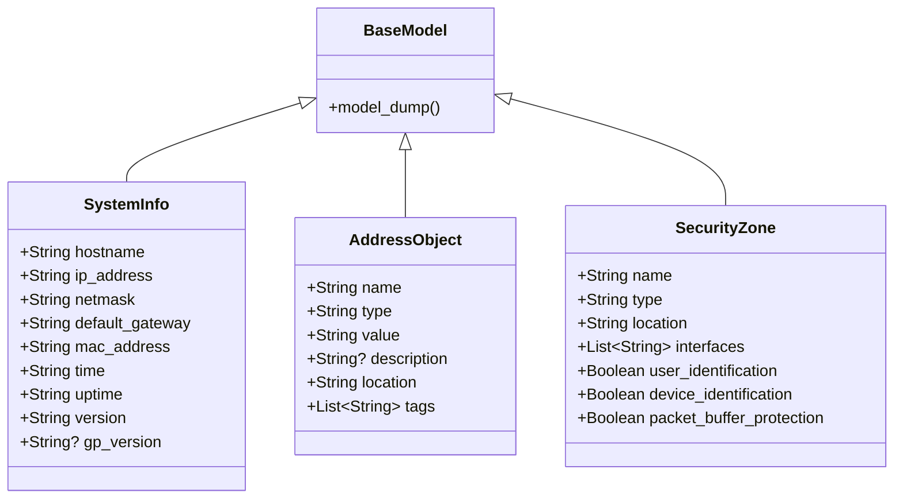

### 4. Error Handling

The project implements a comprehensive error handling hierarchy:

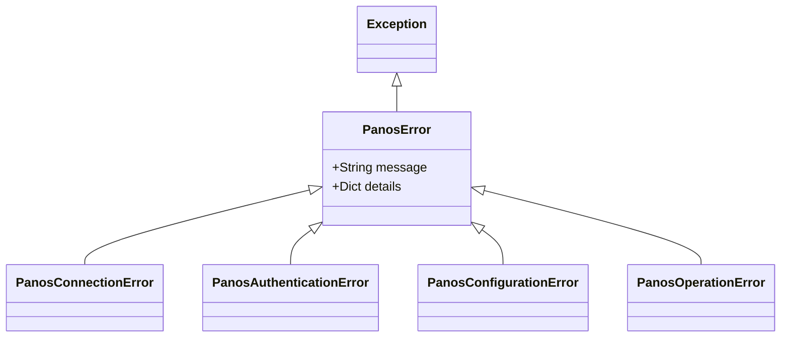

## Data Flow

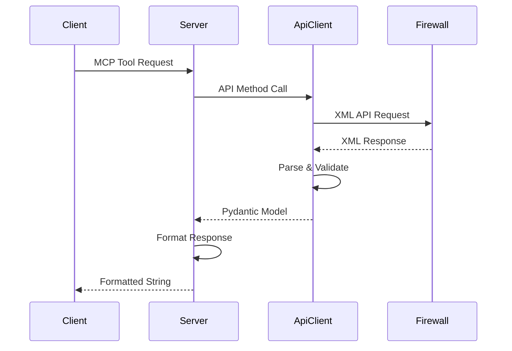

## Configuration

The server uses environment variables for configuration:
- `PANOS_HOSTNAME`: Firewall hostname/IP
- `PANOS_API_KEY`: API key for authentication
- `DEBUG`: Enable debug logging (optional)

## Logging

The server implements structured logging using MCP's logging utilities:
- Request-specific context tracking
- Error details and stack traces
- Debug-level API request/response logging
- Operation status and timing information

## Security Considerations

1. **API Authentication**
   - API key-based authentication
   - Environment variable configuration
   - No hardcoded credentials

2. **HTTPS Communication**
   - TLS encryption for API calls
   - Certificate verification (configurable)

3. **Input Validation**
   - Pydantic model validation
   - Type checking and constraints
   - XML response validation

## Performance Optimizations

1. **Asynchronous Operations**
   - Non-blocking HTTP requests
   - Concurrent API calls where possible
   - Efficient resource cleanup

2. **Response Processing**
   - Streaming XML parsing
   - Memory-efficient data structures
   - Lazy evaluation where appropriate

## Error Handling Strategy

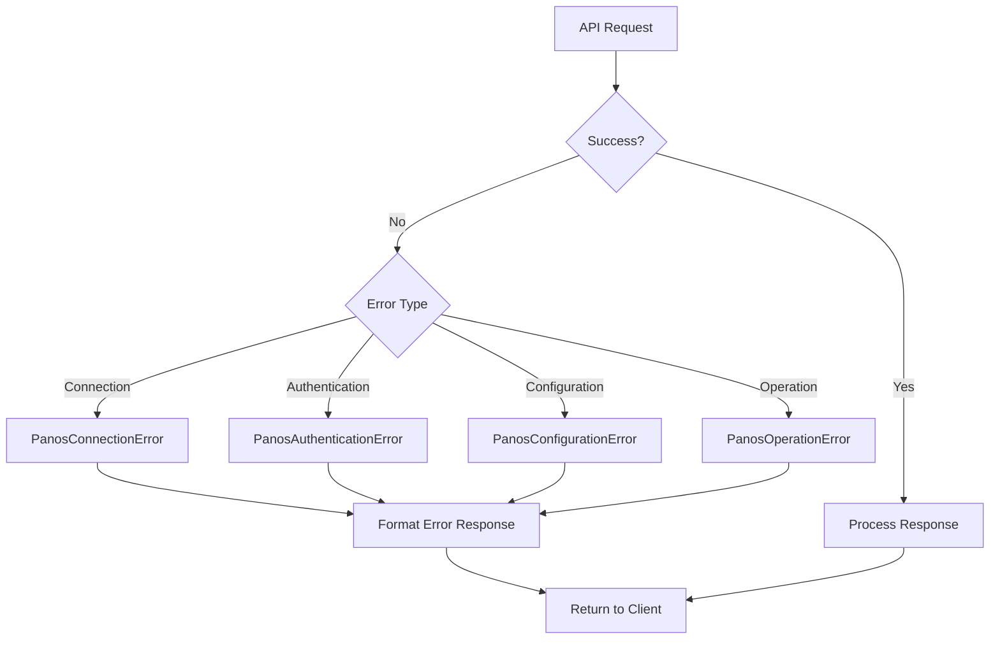

# Architecture Overview

## System Components

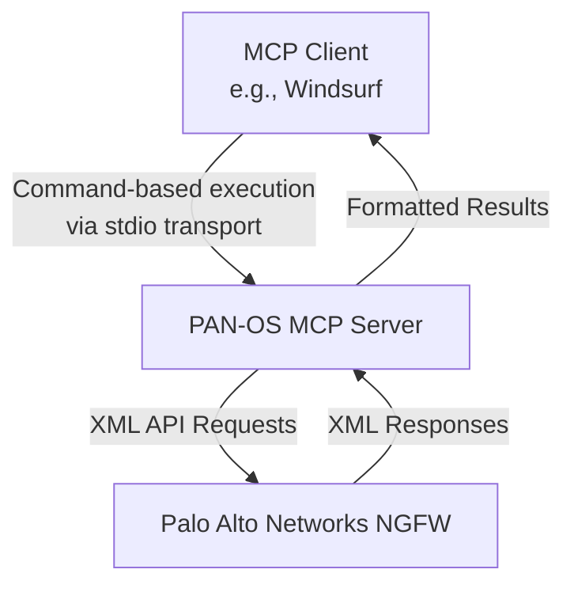

## Component Interactions

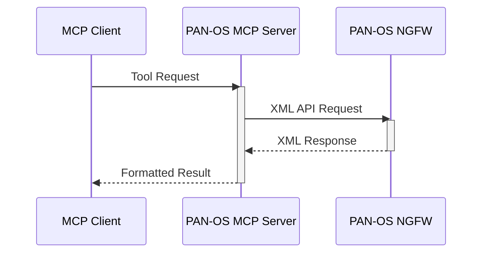

## Data Flow

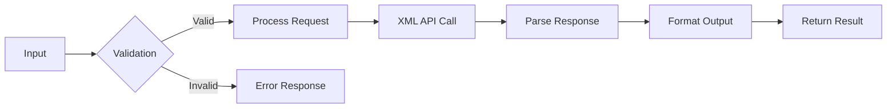

## Error Handling

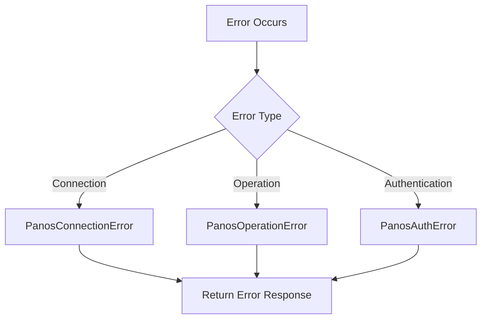

The PAN-OS MCP Server architecture is designed to provide a robust and efficient interface between MCP clients and Palo Alto Networks firewalls. The system is built using modern Python async/await patterns and leverages the `modelcontextprotocol` SDK for seamless integration.

## Key Components

1. **MCP Server (`server.py`)**
   - Implements the FastMCP interface
   - Handles tool registration and execution
   - Manages request/response lifecycle
   - Provides error handling and logging

2. **API Client (`pan_os_api.py`)**
   - Manages XML API communication
   - Handles authentication and session management
   - Implements request retry logic
   - Provides response parsing and validation

3. **Data Models (`models.py`)**
   - Defines Pydantic models for data validation
   - Ensures type safety throughout the application
   - Provides serialization/deserialization

4. **Configuration Management**
   - Environment-based configuration
   - Secure credential handling
   - Runtime configuration validation

## Performance Considerations

1. **Async Operations**
   - All I/O operations are async
   - Connection pooling for efficiency
   - Proper resource cleanup

2. **Memory Management**
   - Streaming response parsing
   - Efficient data structures
   - Resource limiting where appropriate

3. **Error Recovery**
   - Automatic reconnection
   - Request retries with backoff
   - Circuit breaker implementation

## Security Measures

1. **Authentication**
   - API key-based auth
   - Secure key storage
   - Session management

2. **Input Validation**
   - Type checking
   - Schema validation
   - Input sanitization

3. **Error Handling**
   - Secure error messages
   - Proper exception handling
   - Audit logging

## Logging Strategy

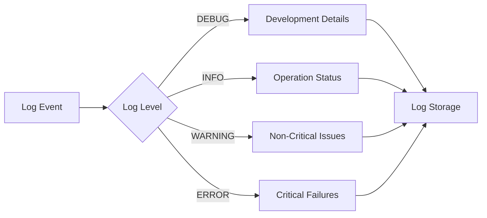

The logging system provides comprehensive visibility into the server's operation while maintaining security and performance.
