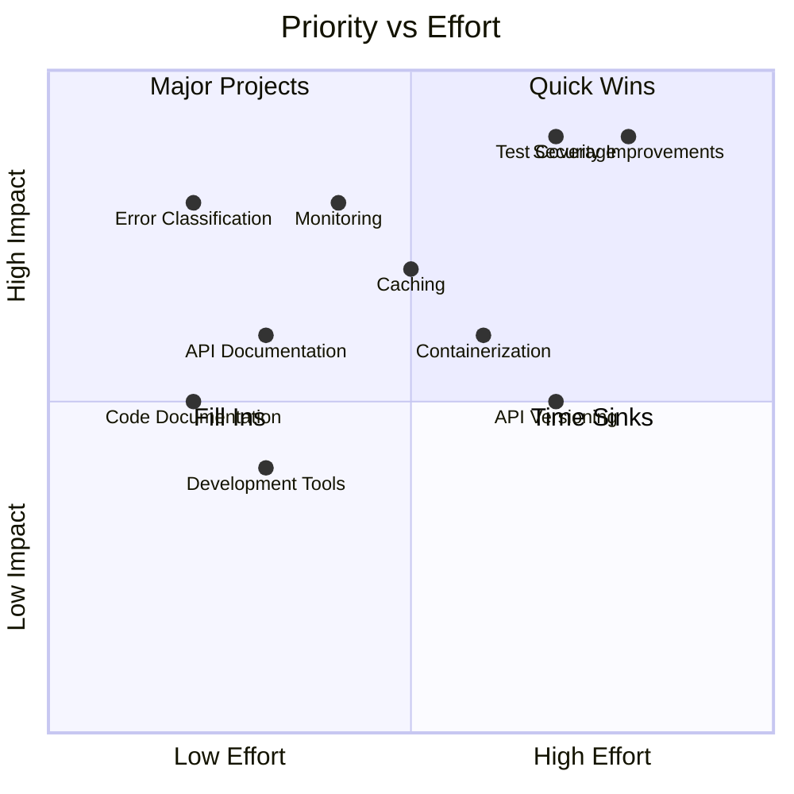
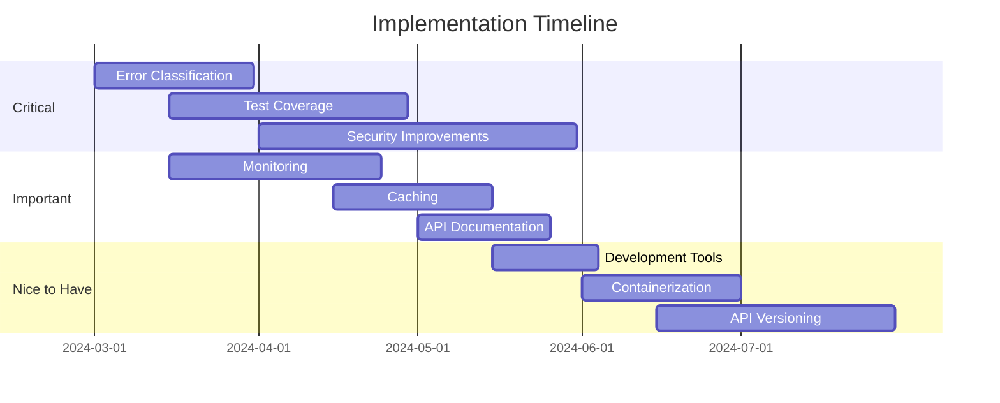

# PAN-OS MCP Server: Areas for Improvement

## 1. Code Organization and Structure

### 1.1 API Client Refactoring
- Split `PanosApiClient` into smaller, focused classes (Single Responsibility Principle)
- Create separate classes for different API operations (address objects, zones, etc.)
- Remove the unused `PANOSClient` class or implement its functionality

### 1.2 Type Hints and Validation
- Add more comprehensive type hints throughout the codebase
- Use more specific types instead of `Any` where possible
- Consider using `TypedDict` for dictionary return types

### 1.3 Configuration Management
- Implement a more robust configuration system
- Add configuration validation and schema documentation
- Support for different configuration sources (files, environment, etc.)

## 2. Error Handling and Logging

### 2.1 Error Classification
- Add more specific error types for different API failures
- Implement retry logic for transient failures
- Add error correlation IDs for tracking issues across components

### 2.2 Logging Enhancements
- Add more structured logging fields
- Implement log rotation and archival
- Add performance metrics logging
- Consider adding OpenTelemetry integration

## 3. Security Improvements

### 3.1 Authentication and Authorization
- Add support for multiple authentication methods
- Implement role-based access control
- Add API key rotation support

### 3.2 Communication Security
- Implement proper certificate validation
- Add support for custom CA certificates
- Add support for mutual TLS authentication

## 4. Performance Optimizations

### 4.1 Caching
- Implement caching for frequently accessed data
- Add cache invalidation strategies
- Support for distributed caching

### 4.2 Connection Management
- Implement connection pooling
- Add circuit breaker pattern for API calls
- Optimize concurrent request handling

## 5. Testing

### 5.1 Test Coverage
- Add more unit tests
- Implement integration tests
- Add performance tests
- Add security tests

### 5.2 Test Infrastructure
- Add test fixtures and factories
- Implement mock PAN-OS API server
- Add CI/CD pipeline tests

## 6. Documentation

### 6.1 Code Documentation
- Add more detailed docstrings
- Include usage examples in docstrings
- Add architecture decision records (ADRs)

### 6.2 User Documentation
- Add troubleshooting guides
- Include configuration examples
- Add performance tuning guide

## 7. Feature Additions

### 7.1 New Functionality
- Add support for more PAN-OS API endpoints
- Implement configuration management tools
- Add support for policy management
- Add support for log retrieval and analysis

### 7.2 Monitoring and Observability
- Add health check endpoints
- Implement metrics collection
- Add support for distributed tracing
- Add alerting capabilities

## 8. Development Experience

### 8.1 Development Tools
- Add development container configuration
- Implement pre-commit hooks
- Add code formatting tools
- Add dependency management tools

### 8.2 Debugging Support
- Add better debug logging
- Implement request/response tracing
- Add performance profiling tools

## 9. Deployment and Operations

### 9.1 Containerization
- Add Docker support
- Create Kubernetes manifests
- Implement health probes

### 9.2 Configuration Management
- Add support for configuration templates
- Implement configuration validation
- Add support for secrets management

## 10. API Design

### 10.1 API Versioning
- Implement API versioning
- Add API deprecation handling
- Implement backward compatibility

### 10.2 API Documentation
- Add OpenAPI/Swagger documentation
- Include API examples
- Add API versioning documentation

## Priority Matrix

## Implementation Timeline

